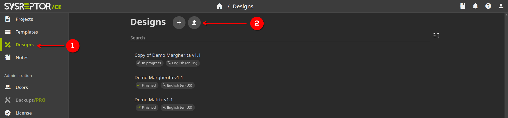

# Sample Penetration Test Reports
Here are some sample reports and report templates I use for pentest report writing.
## How to import sysreptor design
Got to the *Design* tab in the sysreptor web-interface, and then click on the import button, and then select the archive: 

# TODO
- [ ] Create a guide blog on how to report using the created designs
- Update Design:
  - [ ] Add field for consultancy website to be used in the footer
  - [ ] Improve the way fidning severity is displayed
  - [ ] Fix multiple affected components issue
